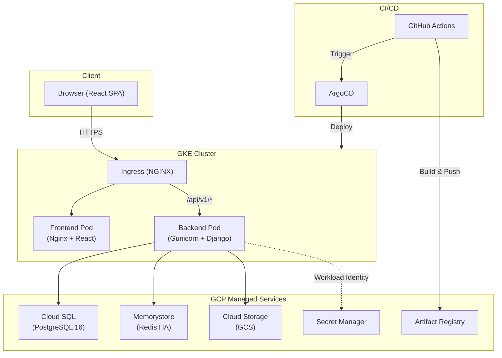
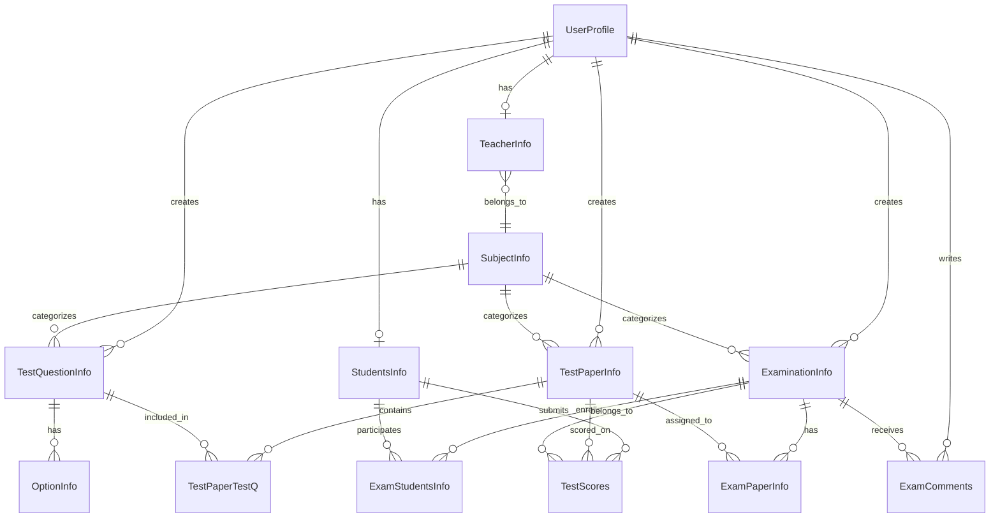
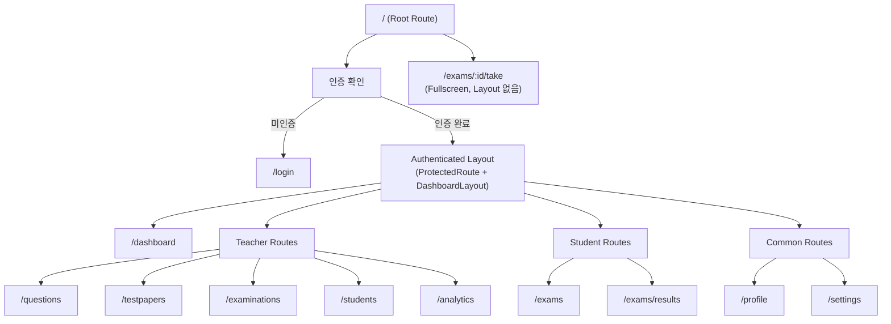
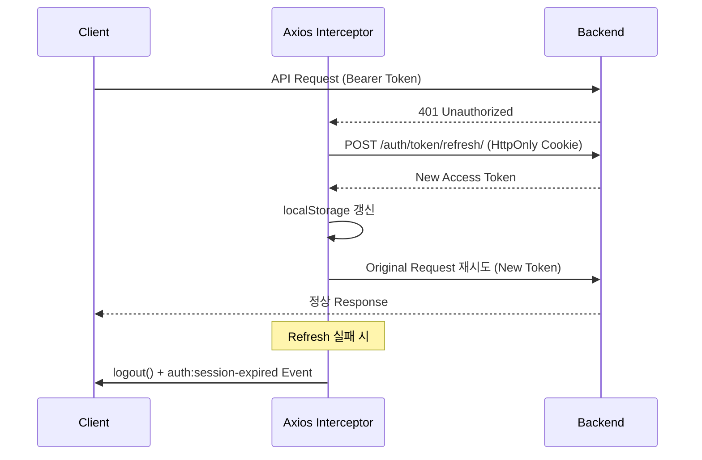
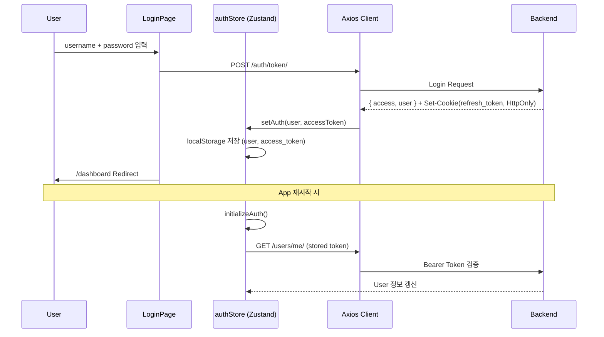
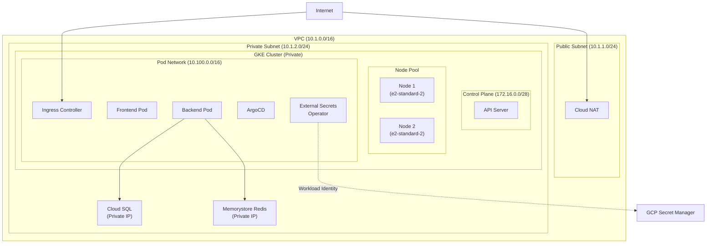
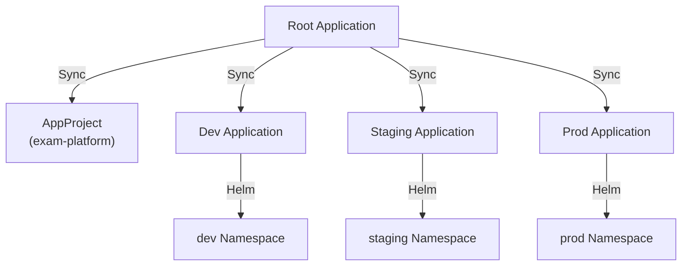
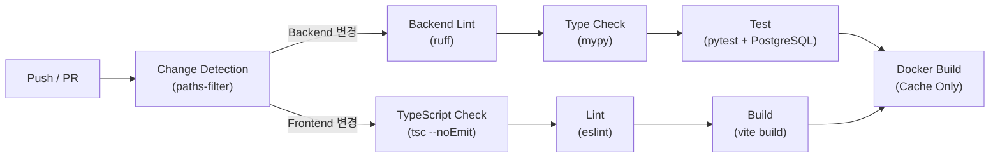
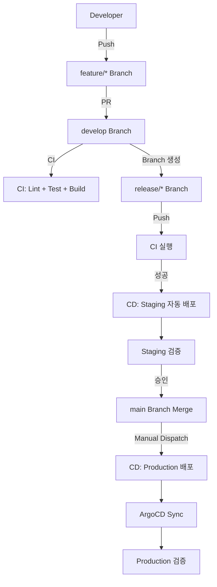
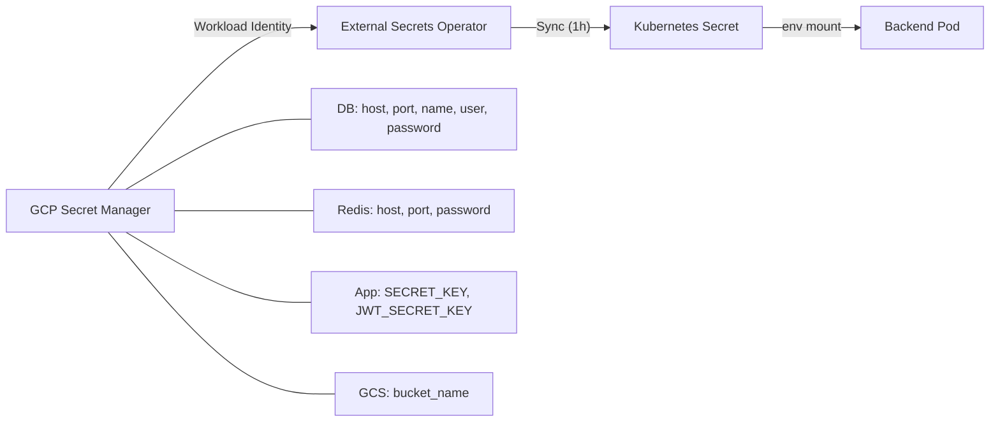

# Architecture

## 개요

Exam Platform은 온라인 시험 관리 시스템으로, Django REST Backend와 React SPA Frontend로 구성된다.
GKE 기반 Kubernetes Cluster에 배포되며, ArgoCD GitOps와 GitHub Actions CI/CD Pipeline을 통해 운영한다.

---

## 1. System Overview



|  | 구성 요소 | 역할 |
|---|-----------|------|
| **Frontend** | React 19 + TypeScript + Vite | SPA, 사용자 인터페이스 |
| **Backend** | Django 5.2 + DRF | REST API, 비즈니스 로직 |
| **Database** | Cloud SQL (PostgreSQL 16) | 영속 데이터 저장 |
| **Cache** | Memorystore (Redis HA) | Session/Cache |
| **Storage** | GCS | 정적 파일, 이미지 |
| **Orchestration** | GKE (Kubernetes) | Container 관리 |
| **CI/CD** | GitHub Actions + ArgoCD | Build, Test, Deploy |

---

## 2. Technology Stack

### Backend

| 기술 | 버전 | 용도 |
|------|------|------|
| Python | 3.14 | Runtime |
| Django | 5.2+ | Web Framework |
| Django REST Framework | 3.15+ | REST API |
| SimpleJWT | 5.3+ | JWT 인증 |
| drf-spectacular | 0.27+ | OpenAPI Schema 생성 |
| django-filter | 24.3+ | Query Filtering |
| django-cors-headers | 4.6+ | CORS 처리 |
| bleach | 6.1+ | HTML Sanitization |
| psycopg | 3.2+ | PostgreSQL Adapter |
| Gunicorn | 23.0+ | WSGI Server |
| Redis | 5.0+ | Cache Client |
| ruff | - | Linting/Formatting |
| mypy | - | Type Checking |
| pytest | - | Testing |

### Frontend

| 기술 | 버전 | 용도 |
|------|------|------|
| React | 19.2 | UI Framework |
| TypeScript | 5.9 | Type Safety |
| Vite | 7.2 | Build Tool |
| TanStack Router | 1.141 | Client Routing |
| TanStack Query | 5.90 | Server State 관리 |
| Zustand | 5.0 | Client State 관리 |
| Axios | 1.13 | HTTP Client |
| React Hook Form + Zod | 7.68 / 4.2 | Form 관리 + Validation |
| shadcn/ui + Radix UI | - | UI Component |
| Tailwind CSS | 4.1 | Utility CSS |
| Framer Motion | 12.23 | Animation |
| Recharts | 3.6 | Chart |
| Vitest | 4.0 | Unit Test |
| Playwright | 1.57 | E2E Test |

### Infrastructure

| 기술 | 용도 |
|------|------|
| GKE | Kubernetes Cluster 관리 |
| Terraform | Infrastructure as Code |
| Helm | Kubernetes Package 관리 |
| ArgoCD | GitOps CD |
| GitHub Actions | CI Pipeline |
| Cloud SQL (PostgreSQL 16) | Managed Database |
| Memorystore (Redis) | Managed Cache |
| GCS | Object Storage |
| Artifact Registry | Container Image Registry |
| GCP Secret Manager | Secret 관리 |
| External Secrets Operator | Secret 동기화 |
| Workload Identity | GKE-GCP IAM 연동 |

---

## 3. Backend Architecture

### 3.1 Django Apps 구조

```
examonline/
├── config/           # Django 설정 (base, local, production, api)
├── apps/
│   ├── core/         # 공통 유틸리티 (Health Check, Pagination, Permission, Validator)
│   ├── user/         # 사용자 관리, 인증, Dashboard
│   ├── testquestion/ # 문제 CRUD, 공유
│   ├── testpaper/    # 시험지 구성, 채점
│   ├── examination/  # 시험 일정, 참가자 관리
│   └── operation/    # 댓글, 메시지, 즐겨찾기
├── manage.py
└── requirements/
```

| App | 책임 |
|-----|------|
| `core` | Health Check Endpoint, Custom Pagination, Role 기반 Permission Class, XSS Sanitization Field, Image Validator |
| `user` | UserProfile(AbstractUser 확장), StudentInfo/TeacherInfo, SubjectInfo, JWT 인증, Dashboard Service |
| `testquestion` | TestQuestionInfo(객관식/주관식/빈칸채우기), OptionInfo, Soft Delete, 공유 기능 |
| `testpaper` | TestPaperInfo, TestPaperTestQ(M:N 매핑), TestScores(JSONField 기반 채점 기록) |
| `examination` | ExaminationInfo(시험 일정/상태), ExamPaperInfo, ExamStudentsInfo, 시험 응시 API |
| `operation` | ExamComments, UserMessage, UserFavorite |

### 3.2 Data Model (ER Diagram)



### 3.3 REST API 구조

모든 Endpoint는 `/api/v1/` Prefix를 사용한다.

**인증 (Auth)**

| Method | Endpoint | 설명 |
|--------|----------|------|
| POST | `/auth/token/` | JWT Token 발급 (Login) |
| POST | `/auth/token/refresh/` | Access Token 갱신 |
| POST | `/auth/register/` | 사용자 등록 |

**사용자 (User)**

| Method | Endpoint | 설명 | 권한 |
|--------|----------|------|------|
| GET | `/users/me/` | 내 프로필 조회 | Authenticated |
| PUT/PATCH | `/users/me/` | 내 프로필 수정 | Authenticated |
| POST | `/users/me/change-password/` | 비밀번호 변경 | Authenticated |
| GET | `/dashboard/student/` | Student Dashboard | Student |
| GET | `/dashboard/teacher/` | Teacher Dashboard | Teacher |
| GET | `/students/` | 학생 목록 | Teacher |
| GET | `/students/{id}/` | 학생 상세 | Teacher |

**과목 (Subject)**

| Method | Endpoint | 설명 |
|--------|----------|------|
| GET/POST | `/subjects/` | 과목 목록 / 생성 |
| GET/PUT/DELETE | `/subjects/{id}/` | 과목 상세 / 수정 / 삭제 |

**문제 (Question)**

| Method | Endpoint | 설명 | 권한 |
|--------|----------|------|------|
| GET | `/questions/` | 문제 목록 (Filter 지원) | Authenticated |
| POST | `/questions/` | 문제 생성 | Teacher |
| GET/PUT/DELETE | `/questions/{id}/` | 문제 상세 / 수정 / 삭제 | Owner/Teacher |
| POST | `/questions/{id}/share/` | 공유 상태 Toggle | Owner |

**시험지 (TestPaper)**

| Method | Endpoint | 설명 | 권한 |
|--------|----------|------|------|
| GET/POST | `/testpapers/` | 시험지 목록 / 생성 | Teacher |
| GET/PUT/DELETE | `/testpapers/{id}/` | 시험지 상세 / 수정 / 삭제 | Creator |
| POST | `/testpapers/{id}/add_questions/` | 문제 추가 | Creator |
| DELETE | `/testpapers/{id}/remove_question/` | 문제 제거 | Creator |
| GET | `/testpapers/{id}/preview/` | 시험지 미리보기 | Authenticated |

**시험 (Examination)**

| Method | Endpoint | 설명 | 권한 |
|--------|----------|------|------|
| GET/POST | `/examinations/` | 시험 목록 / 생성 | Teacher |
| GET/PUT/DELETE | `/examinations/{id}/` | 시험 상세 / 수정 / 삭제 | Creator |
| POST | `/examinations/{id}/enroll_students/` | 학생 일괄 등록 | Creator |
| GET | `/examinations/{id}/enrolled_students/` | 등록 학생 목록 | Authenticated |

**시험 응시 (Exam Taking)**

| Method | Endpoint | 설명 | 권한 |
|--------|----------|------|------|
| GET | `/exams/` | 응시 가능 시험 목록 | Student |
| GET | `/exams/{id}/` | 시험 문제 조회 | Enrolled Student |
| POST | `/exams/{id}/start/` | 시험 시작 | Student |
| POST | `/exams/{id}/submit/` | 시험 제출 | Student |
| GET | `/submissions/` | 제출 내역 | Authenticated |

**Health Check**

| Method | Endpoint | 설명 |
|--------|----------|------|
| GET | `/health/` | 전체 Health Check |
| GET | `/health/live/` | Liveness Probe |
| GET | `/health/ready/` | Readiness Probe |

### 3.4 인증/인가

**JWT 인증 (SimpleJWT)**

| 항목 | 설정값 |
|------|--------|
| Access Token 수명 | 15분 |
| Refresh Token 수명 | 7일 |
| Token Rotation | True |
| Blacklist After Rotation | True |
| Custom Claims | `user_type`, `nick_name`, `email` |
| Refresh Token 저장 | HttpOnly Cookie |

**Role 기반 접근 제어 (RBAC)**

| Permission Class | 동작 |
|------------------|------|
| `IsTeacher` | Teacher Role만 접근 허용 |
| `IsStudent` | Student Role만 접근 허용 |
| `IsOwnerOrTeacher` | Teacher는 전체 접근, 나머지는 본인 리소스만 |
| `IsExamCreator` | 시험 생성자만 수정 가능, 조회는 전체 |
| `IsQuestionOwner` | 문제 소유자만 수정, Student는 공유 문제만 조회 |

**Rate Limiting**

| 대상 | 제한 |
|------|------|
| Anonymous | 30 req/min |
| Authenticated | 120 req/min |
| Auth Endpoint | 10 req/min |

### 3.5 주요 Pattern

| Pattern | 설명 |
|---------|------|
| **Soft Delete** | `TestQuestionInfo.is_del` 필드 사용, 조회 시 `is_del=False` 필터링 |
| **Service Layer** | `StudentDashboardService`, `TeacherDashboardService`에서 비즈니스 로직 분리 |
| **XSS Sanitization** | `XSSSanitizedCharField`로 `bleach.clean()`을 통한 HTML Tag 제거 |
| **Image Validation** | Extension + Size(5MB) + Magic Number(MIME) 3중 검증 |
| **Custom Pagination** | `StandardResultsSetPagination` (page_size=20, max=100) |
| **Custom Exception Handler** | Production에서 5xx Error 상세 정보 숨김 |
| **CreatUserSerializerMixin** | `create_user` 필드를 `{id, nick_name}` 형태로 Serialize |
| **Filtering** | `django-filter` + `SearchFilter` + `OrderingFilter` 조합 |

---

## 4. Frontend Architecture

### 4.1 Directory 구조

```
frontend/src/
├── api/               # Axios 기반 API Service Layer
│   ├── client.ts      # Axios Instance, Interceptor, Token Refresh
│   ├── auth.ts        # 인증 API
│   ├── question.ts    # 문제 CRUD
│   ├── testpaper.ts   # 시험지 API
│   ├── exam.ts        # 시험 응시 API
│   ├── dashboard.ts   # Dashboard API
│   ├── score.ts       # 성적 API
│   └── student.ts     # 학생 관리 API
├── components/
│   ├── ui/            # shadcn/ui Component (17개)
│   ├── layout/        # DashboardLayout, Sidebar, MobileHeader
│   ├── charts/        # Recharts 기반 Chart Component
│   ├── animation/     # Framer Motion Wrapper
│   ├── auth/          # ProtectedRoute
│   └── ErrorBoundary.tsx
├── features/          # Feature Module (Page 단위)
│   ├── auth/          # LoginPage, RegisterPage
│   ├── dashboard/     # Dashboard (Student/Teacher 분기)
│   ├── examinations/  # 시험 관리 (Teacher)
│   ├── exams/         # 시험 응시 (Student)
│   ├── questions/     # 문제 관리
│   ├── testpapers/    # 시험지 관리
│   ├── students/      # 학생 목록/상세
│   ├── profile/       # 프로필, 비밀번호 변경
│   ├── settings/      # 설정
│   └── analytics/     # 분석
├── hooks/             # Custom Hook
├── lib/               # Utility (cn(), QueryClient, Animation Constants)
├── stores/            # Zustand Store
│   ├── authStore.ts   # 인증 상태 (persist)
│   └── sidebarStore.ts
├── types/             # TypeScript Interface 정의
├── constants/         # 상수 정의
├── utils/             # Error 처리, 시간, 번역
└── main.tsx           # Entry Point
```

### 4.2 Routing

TanStack Router를 사용하며, `beforeLoad` Guard로 Role 기반 접근 제어를 구현한다.



- `/` 접근 시 `/dashboard`로 Redirect
- `/exams/:id/take`는 Root Route 직접 연결 (전체 화면 시험 응시 UI)
- Teacher/Student Route에 `beforeLoad`에서 `user_type` 검증, 불일치 시 `/dashboard` Redirect

### 4.3 State Management

**Zustand (Client State)**

| Store | 상태 | Persist |
|-------|------|---------|
| `authStore` | `user`, `accessToken`, `isAuthenticated`, `isLoading` | localStorage (`auth-storage`) |
| `sidebarStore` | `isOpen`, `isCollapsed` | 없음 |

- `authStore.initializeAuth()`: App Mount 시 localStorage에서 Token 복원, `/users/me/` 호출로 사용자 정보 갱신
- Safe localStorage Wrapper(`safeGetItem`, `safeSetItem`)로 Private Browsing 등 예외 처리

**TanStack Query (Server State)**

| 설정 | 값 |
|------|-----|
| `refetchOnWindowFocus` | `false` |
| `retry` | 1 |
| `staleTime` | 5분 |

- 모든 API 요청은 TanStack Query의 `useQuery`/`useMutation`으로 처리
- 자동 Cache Invalidation, Background Refetch 지원

### 4.4 API Layer

**Axios Instance 설정**

| 항목 | 값 |
|------|-----|
| Base URL | `VITE_API_BASE_URL` |
| Timeout | 20초 |
| `withCredentials` | `true` (Cookie 전송) |
| Content-Type | `application/json` |

**Token Refresh Flow**



**Error 처리**

- Backend Error Response를 `{ detail, code, ...details }` 형태로 정규화
- 영문 Error Message를 한국어로 자동 번역 (`errorMessages.ts`)
- `isAxiosError()` Type Guard 사용

### 4.5 UI

| 계층 | 기술 | 역할 |
|------|------|------|
| Primitive | Radix UI | Accessible, Unstyled Component |
| Component | shadcn/ui | Styled Component (17종) |
| Styling | Tailwind CSS 4.1 | Utility-First CSS |
| Class 합성 | `cn()` (clsx + tailwind-merge) | 조건부 Class 관리 |
| Icon | Lucide React | Icon Library |
| Animation | Framer Motion | Motion/Transition |
| Theme | next-themes | Light/Dark Mode |
| Toast | Sonner | Notification |
| Chart | Recharts | Dashboard Chart |

### 4.6 인증 Flow



---

## 5. Infrastructure Architecture

### 5.1 GKE Cluster 구성



**Cluster 설정**

| 항목 | Staging | Production |
|------|---------|------------|
| Location | asia-northeast3-a | asia-northeast3-a |
| Release Channel | REGULAR | REGULAR |
| Private Nodes | Yes | Yes |
| Machine Type | e2-standard-2 | e2-standard-2 |
| Node 수 (Min/Max) | 1 / 5 | 1 / 10 |
| Disk | pd-standard 50GB | pd-standard 50GB |
| Network Policy | Calico | Calico |
| Shielded GKE | Yes | Yes |
| Workload Identity | Yes | Yes |
| Deletion Protection | No | Yes |

### 5.2 Terraform Module 구조

```
terraform/
├── modules/
│   ├── gcp-vpc/          # VPC, Subnet, Cloud Router, NAT, Firewall
│   ├── gke/              # GKE Cluster, Node Pool, Service Account
│   ├── cloudsql/         # Cloud SQL Instance, DB, User, Secret 연동
│   ├── memorystore/      # Redis Instance (HA, 암호화)
│   ├── gcs/              # Storage Bucket (Lifecycle, Versioning)
│   ├── gar/              # Artifact Registry (Docker)
│   ├── cloud-build/      # Cloud Build Trigger
│   └── gcs-state-bucket/ # Terraform State Backend
└── environments/
    ├── gcp-staging/      # Staging 환경 변수
    └── gcp-prod/         # Production 환경 변수
```

**Network 설정**

| 항목 | CIDR |
|------|------|
| Public Subnet | 10.1.1.0/24 |
| Private Subnet | 10.1.2.0/24 |
| GKE Pod (Secondary) | 10.100.0.0/16 |
| GKE Service (Secondary) | 10.101.0.0/20 |
| Master Control Plane | 172.16.0.0/28 |

### 5.3 Helm Chart 구조

```
charts/exam-platform/
├── templates/
│   ├── backend/
│   │   ├── deployment.yaml         # Django + Gunicorn
│   │   └── service.yaml
│   ├── frontend/
│   │   ├── deployment.yaml         # Nginx + React SPA
│   │   └── service.yaml
│   ├── ingress.yaml                # Ingress 규칙
│   ├── ingress-auth-rewrite.yaml   # Auth Redirect 규칙
│   ├── configmap.yaml              # 비민감 설정
│   ├── secret.yaml                 # Inline Secret (Dev/Local)
│   ├── external-secret.yaml        # ESO 연동 (Staging/Prod)
│   ├── networkpolicy.yaml          # Network Policy
│   ├── serviceaccount.yaml
│   └── namespace.yaml
├── values.yaml                     # Default
├── values-dev.yaml                 # Dev 환경
├── values-staging.yaml
├── values-prod.yaml
├── values-e2e.yaml
└── values-local.yaml
```

**Environment 별 구성 비교**

| 항목 | Dev | Staging | Production |
|------|-----|---------|------------|
| Backend Replica | 1 | 2 | 2 (HPA: 1~10) |
| Frontend Replica | 1 | 2 | 1 |
| HPA | 미사용 | 미사용 | CPU 70% / Memory 80% |
| PDB | 미사용 | 미사용 | minAvailable: 1 |
| Pod Anti-Affinity | 미사용 | 미사용 | Zone 분산 (preferred) |
| External Secrets | 미사용 | 사용 (1h Refresh) | 사용 (1h Refresh) |
| Startup Probe | 미사용 | 사용 | 사용 |
| SSL Cookie | 미사용 | 미사용 | 사용 |
| TLS | 미사용 | 미사용 | cert-manager |
| Domain | localhost | staging.exam.example.com | exam-platform.me |

### 5.4 ArgoCD GitOps

**App of Apps Pattern**을 사용하여 단일 Root Application이 하위 Application을 관리한다.



| 설정 | 값 |
|------|-----|
| Auto-Sync | Enabled (Prune + SelfHeal) |
| Retry | 5회 (Exponential Backoff, 5s~3m) |
| Revision History Limit | 20 |
| Repository | SSH Deploy Key (Secret Manager) |

**AppProject RBAC**

| Role | 권한 |
|------|------|
| admin | 전체 Resource 관리 |
| developer | dev/staging Sync |
| viewer | 읽기 전용 |

### 5.5 Environment 구성

**Managed Service 비교**

| 서비스 | Staging | Production |
|--------|---------|------------|
| Cloud SQL Tier | db-g1-small | db-custom-2-8192 |
| Cloud SQL HA | 미사용 | 사용 |
| Cloud SQL Backup | 7일 PITR | 7일 PITR |
| Cloud SQL SSL | ENCRYPTED_ONLY | ENCRYPTED_ONLY |
| Redis Tier | STANDARD_HA | STANDARD_HA |
| GAR Immutable Tags | 미사용 | 사용 |
| GCS Force Destroy | Yes | No |
| GKE Deletion Protection | No | Yes |

---

## 6. CI/CD Pipeline

### 6.1 CI (GitHub Actions)



| 단계 | Backend | Frontend |
|------|---------|----------|
| Lint | ruff check + format | eslint |
| Type Check | mypy | tsc --noEmit |
| Test | pytest (PostgreSQL 18 Service) | - |
| Build | Docker (Layer Cache) | vite build + Docker (Layer Cache) |
| Tool | uv (Python 3.14) | Node 22 + npm |

**Trigger 조건**
- Push: `main`, `develop`, `feature/*`, `release/*` Branch
- PR: `main`, `develop` Branch 대상
- `dorny/paths-filter`로 변경 감지 후 해당 Component만 실행

### 6.2 CD

**Staging (cd-staging.yml)**

| 항목 | 설정 |
|------|------|
| Trigger | CI 성공 후 (`release/*` Branch) |
| Version | Branch명에서 추출 (예: `release/v1.2.3` -> `v1.2.3`) |
| Image Tag | `staging-{VERSION}`, `staging-latest` |
| Deploy | `helm upgrade --install --atomic` (10분 Timeout) |
| 검증 | `kubectl rollout status` |
| 알림 | Slack Webhook |

**Production (cd-prod.yml)**

| 항목 | 설정 |
|------|------|
| Trigger | Manual (workflow_dispatch), Backend/Frontend 선택 가능 |
| Version | Short SHA (7자, 예: `40efa2d`) |
| Image Tag | `{SHORT_SHA}`, `latest` |
| Deploy | ArgoCD Application Patch + Sync (Hard Refresh) |
| 검증 | Rollout Status + Image Tag 확인 |
| 알림 | Slack Webhook (Image Tag, Replica 정보 포함) |

### 6.3 Image Tagging 전략

| 환경 | Registry | Tag Pattern | 예시 |
|------|----------|-------------|------|
| Staging | `asia-northeast3-docker.pkg.dev/.../exam-platform/` | `staging-{VERSION}` | `staging-v1.2.3` |
| Production | `asia-northeast3-docker.pkg.dev/.../prod-exam-platform/` | `{SHORT_SHA}` | `40efa2d` |

### 6.4 Pipeline Flow (전체)



---

## 7. Security

### 7.1 Network

| 영역 | 구현 |
|------|------|
| Private Cluster | GKE Node에 Public IP 미할당 |
| VPC | Public/Private Subnet 분리, Private IP Google Access |
| Cloud NAT | Outbound 트래픽 전용 |
| Firewall | Internal 통신, IAP SSH, Health Check만 허용 |
| Master Authorized Networks | Private Subnet + 추가 CIDR만 API Server 접근 가능 |
| Cloud SQL | Private IP 전용, Public IP 미사용, SSL 필수 |
| Network Policy | Calico 기반 (Pod 간 통신 제어 지원) |
| Metadata 차단 | Egress에서 `169.254.169.254/32` 차단 |

### 7.2 Application

| 영역 | 구현 |
|------|------|
| 인증 | JWT (Access 15분 + Refresh 7일 HttpOnly Cookie) |
| XSS | `XSSSanitizedCharField`로 HTML Tag 제거 (`bleach.clean()`) |
| Image 검증 | Extension + Size(5MB) + Magic Number MIME 3중 검증 |
| CORS | Allowed Origin 명시, `credentials: true` |
| CSRF | `CsrfViewMiddleware`, `SameSite=Lax` Cookie |
| Rate Limiting | Anonymous 30/min, Auth 120/min, Login 10/min |
| Password | Django Validator 4종 (유사도, 최소 길이, 공통 패턴, 숫자 전용 차단) |
| Error 정보 | Production 5xx Error에서 상세 정보 숨김 |

### 7.3 Infrastructure

| 영역 | 구현 |
|------|------|
| Workload Identity | GKE Pod -> GCP IAM 연동 (Credential 파일 불필요) |
| External Secrets Operator | GCP Secret Manager -> Kubernetes Secret 동기화 |
| Pod Security Context | `runAsNonRoot`, `runAsUser: 1000`, `drop: ALL` capabilities |
| Shielded GKE | Secure Boot + Integrity Monitoring |
| GKE Metadata | v2 Metadata Server (GKE_METADATA) |
| Image Registry | Private Registry, Production Immutable Tags |
| Deletion Protection | Production GKE Cluster, Cloud SQL |

### 7.4 Secret Management



| ExternalSecret | 포함 Secret |
|----------------|-------------|
| `exam-platform-db` | POSTGRES_HOST, PORT, DB, USER, PASSWORD |
| `exam-platform-redis` | REDIS_HOST, PORT, PASSWORD |
| `exam-platform-app` | SECRET_KEY, JWT_SECRET_KEY |
| `exam-platform-gcs` | GCS_BUCKET_NAME |

---

## 관련 문서

| 문서 | 설명 |
|------|------|
| [`docs/security.md`](../security.md) | Backend 보안 상세 |
| [`docs/features/`](../features/) | 기능별 상세 문서 |
| [`docs/troubleshooting.md`](../troubleshooting.md) | 트러블슈팅 가이드 |
| [`docs/STAGING_DEPLOYMENT.md`](../STAGING_DEPLOYMENT.md) | Staging 배포 가이드 |
| [`docs/architecture/adr/`](./adr/README.md) | Architecture Decision Records |
| [`docs/secret-management.md`](../secret-management.md) | Secret Management 운영 가이드 |
| [`docs/operational-changes.md`](../operational-changes.md) | Operational Changes Log |
