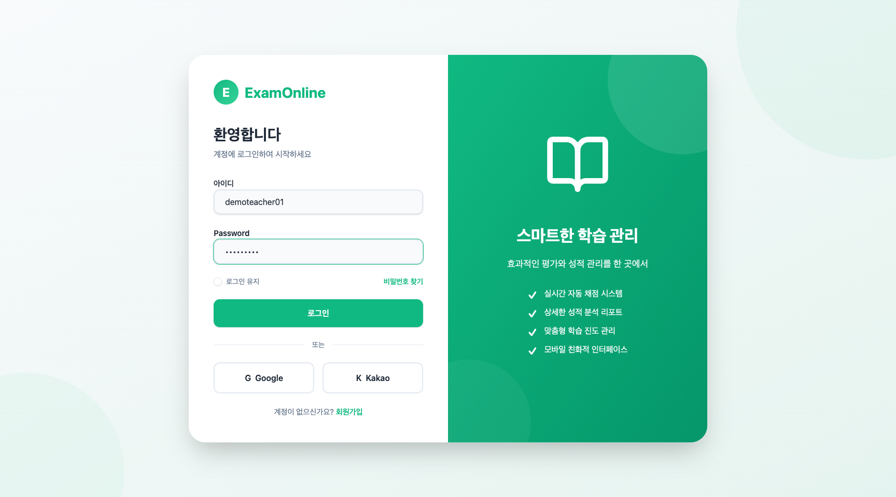
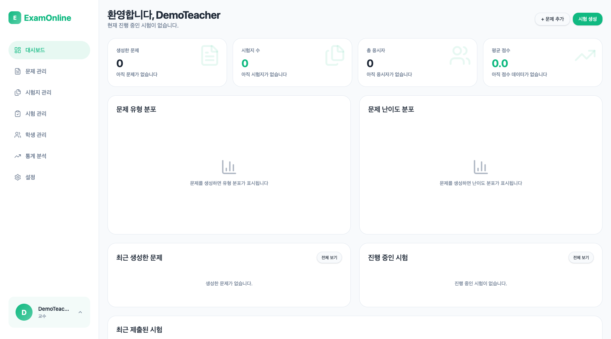

# Step 1: 교사 로그인

## 목표

교사 계정으로 로그인하여 교사 Dashboard에 접근한다.

---

## 진행 순서

### 1. 로그인 페이지 접속

**URL:** `/login`

### 2. 계정 정보 입력

| 필드 | 값 |
|------|-----|
| Username | demo_teacher |
| Password | demo1234! |

### 3. 로그인 버튼 클릭

로그인 버튼을 클릭하여 인증을 완료한다.

---

## 예상 결과

- 로그인 성공 후 교사 Dashboard로 이동
- 상단 네비게이션에 교사 메뉴 표시:
  - 문제 관리
  - 시험지 관리
  - 시험 관리
  - 결과 확인

---

## 다음 단계

[Step 2: 문제 생성](./02-question-create.md)
