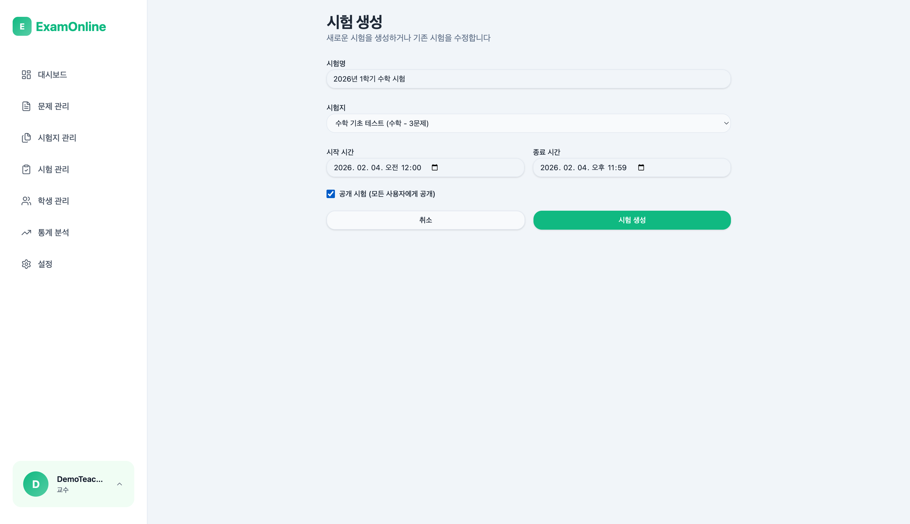

# Step 4: 시험 생성

## 목표

생성한 시험지를 사용하여 학생들이 응시할 수 있는 시험을 생성한다.

---

## 진행 순서

### 1. 시험 관리 페이지 접속

**URL:** `/examinations`

좌측 메뉴에서 "시험 관리"를 클릭하거나 직접 URL로 접속한다.

### 2. 새 시험 생성

**시험 생성** 버튼을 클릭한다.

### 3. 시험 정보 입력

| 필드 | 값 |
|------|-----|
| 시험명 | 2026년 1학기 수학 시험 |
| 시험지 | 수학 기초 테스트 (수학 - 3문제) |
| 시작 시간 | (현재 시간 + 1분) |
| 종료 시간 | (현재 시간 + 2시간) |
| 공개 시험 | 체크 |

**시간 설정 참고:**
- 시작 시간은 반드시 현재 시간 이후여야 한다 (미래 시간만 설정 가능)
- 시작 시간 직후에 시험이 "진행중" 상태로 변경되므로, 가능한 가까운 시간으로 설정
- 종료 시간을 충분히 여유있게 설정

### 4. 저장

**시험 생성** 버튼을 클릭하여 시험을 생성한다.

---

## 예상 결과

- 시험명: 2026년 1학기 수학 시험
- 시험지: 수학 기초 테스트
- 상태: 진행중
- 공개 여부: 공개

---

## 검증 사항

- 시작 시간이 지나면 시험이 "진행중" 상태로 변경되는지 확인
- 공개 설정이 활성화되어 있는지 확인
- 학생이 시험 목록에서 해당 시험을 볼 수 있는지 확인

---

## Navigation

[이전: Step 3 - 시험지 생성](./03-testpaper-create.md) | [다음: Step 5 - 학생 로그인](./05-student-login.md)
