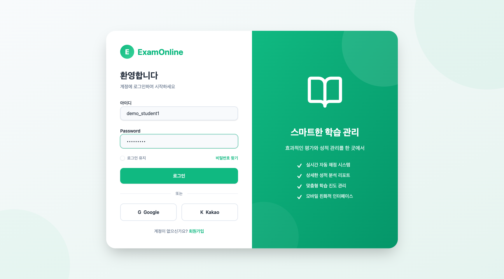
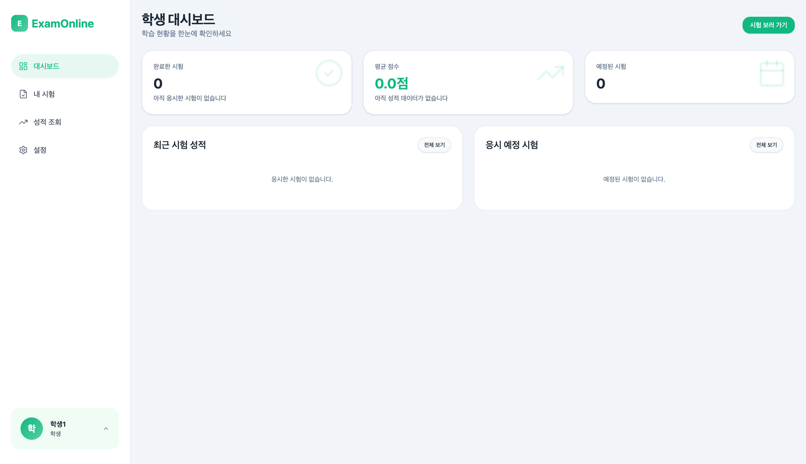

# Step 5: 학생 로그인

## 목표

교사 계정에서 로그아웃 후 학생 계정으로 로그인한다.

---

## 진행 순서

### 1. 로그아웃

좌측 사이드바 하단의 프로필 메뉴를 클릭하고 **로그아웃**을 선택한다.

### 2. 로그인 페이지 접속

**URL:** `/login`

### 3. 계정 정보 입력

| 필드 | 값 |
|------|-----|
| 아이디 | demo_student1 |
| Password | demo1234! |

### 4. 로그인 버튼 클릭

로그인 버튼을 클릭하여 인증을 완료한다.

---

## 예상 결과

- 로그인 성공 후 학생 Dashboard로 이동
- 좌측 메뉴에 학생 메뉴 표시:
  - 대시보드
  - 내 시험
  - 성적 조회
  - 설정

---

## Navigation

[이전: Step 4 - 시험 생성](./04-exam-create.md) | [다음: Step 6 - 시험 응시](./06-exam-take.md)
