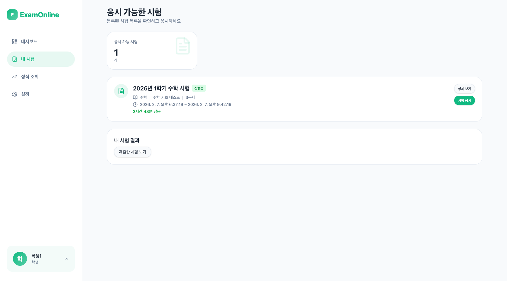
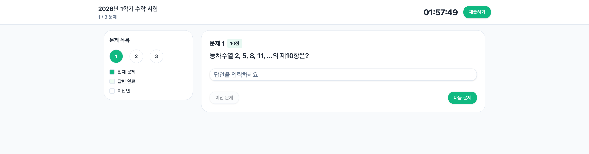
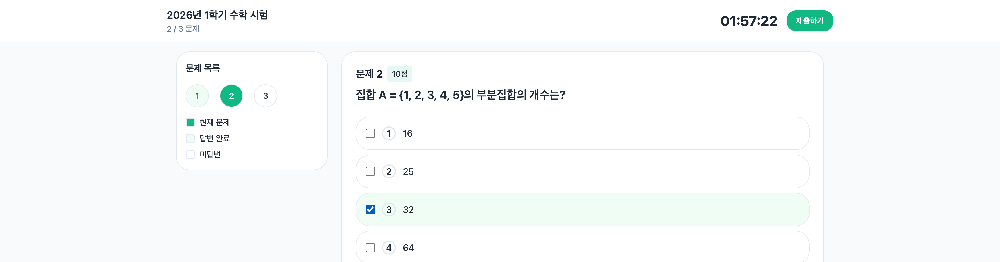
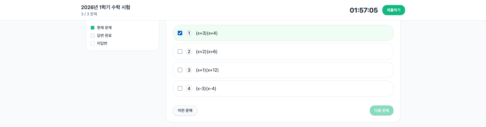
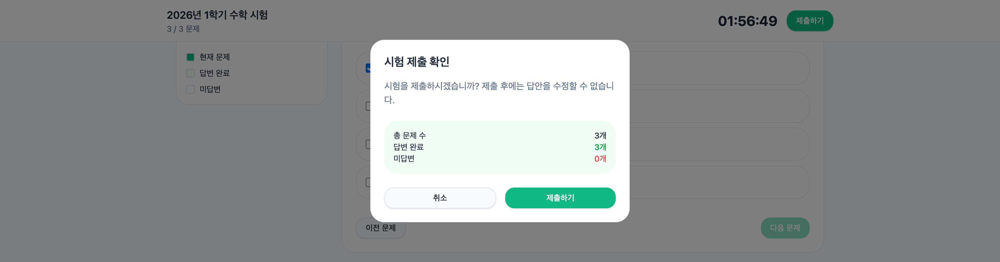

# Step 6: 시험 응시

## 목표

교사가 생성한 시험에 응시하여 답안을 제출한다. 등차수열 문제에서 의도적으로 오답을 입력하여 채점 기능을 검증한다.

---

## 진행 순서

### 1. 시험 목록 페이지 접속

**URL:** `/exams`

좌측 메뉴에서 "내 시험"을 클릭하거나 직접 URL로 접속한다.

### 2. 시험 선택 및 시작

"2026년 1학기 수학 시험"의 **시험 응시** 버튼을 클릭한다.

### 3. 문제 1 답안 입력 (등차수열)

**문제:** 등차수열 2, 5, 8, 11, ...의 제10항은?

**입력:** 30 (오답 - 초항을 반영하지 않고 10 x 3 = 30으로 계산)

### 4. 문제 2 답안 입력 (집합)

**문제:** 집합 A = {1, 2, 3, 4, 5}의 부분집합의 개수는?

| 보기 | 선택 |
|------|------|
| (1) 16 | |
| (2) 25 | |
| (3) 32 | **선택** |
| (4) 64 | |

### 5. 문제 3 답안 입력 (인수분해)

**문제:** 다항식 x^2 + 7x + 12를 인수분해하면?

| 보기 | 선택 |
|------|------|
| (1) (x+3)(x+4) | **선택** |
| (2) (x+2)(x+6) | |
| (3) (x+1)(x+12) | |
| (4) (x-3)(x-4) | |

### 6. 시험 제출

**제출하기** 버튼을 클릭하여 답안을 제출한다.

---

## 예상 결과

- 제출 완료 메시지 표시
- 결과 확인 페이지로 이동 또는 안내

---

## 정답 요약

| 문제 | 정답 |
|------|------|
| 문제 1 (등차수열) | 30 (오답, 정답: 29) |
| 문제 2 (집합) | (3) 32 |
| 문제 3 (인수분해) | (1) (x+3)(x+4) |

---

## Navigation

[이전: Step 5 - 학생 로그인](./05-student-login.md) | [다음: Step 7 - 결과 확인](./07-result-check.md)
