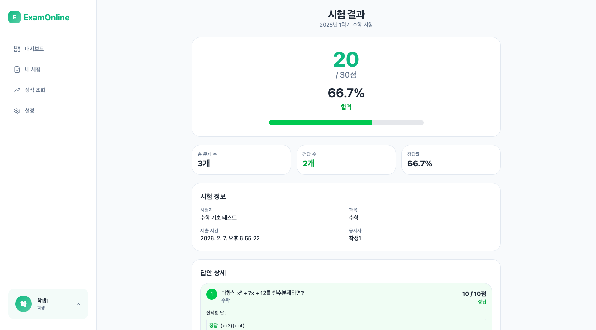

# Step 7: 학생 결과 확인

## 목표

제출한 시험의 결과를 확인한다.

---

## 진행 순서

### 1. 결과 페이지 접속

시험 제출 후 자동으로 결과 페이지로 이동하거나, "내 결과" 메뉴를 통해 접속한다.

**URL:** `/exams/:id/result`

### 2. 점수 확인

| 항목 | 값 |
|------|-----|
| 총점 | 30점 |
| 획득 점수 | 30점 |
| 정답률 | 100% |
| 통과 여부 | 통과 |

### 3. 문제별 결과 확인

| 문제 | 내 답안 | 정답 | 결과 | 배점 |
|------|---------|------|------|------|
| 문제 1 (인수분해) | (x+3)(x+4) | (x+3)(x+4) | 정답 | 10점 |
| 문제 2 (집합) | 32 | 32 | 정답 | 10점 |
| 문제 3 (등차수열) | 29 | 29 | 정답 | 10점 |

---

## 예상 결과

- 30/30점 (만점)
- 정답률 100%
- 모든 문제 정답 처리

---

## 다음 단계

[Step 8: 교사 결과 확인](./08-teacher-review.md)
