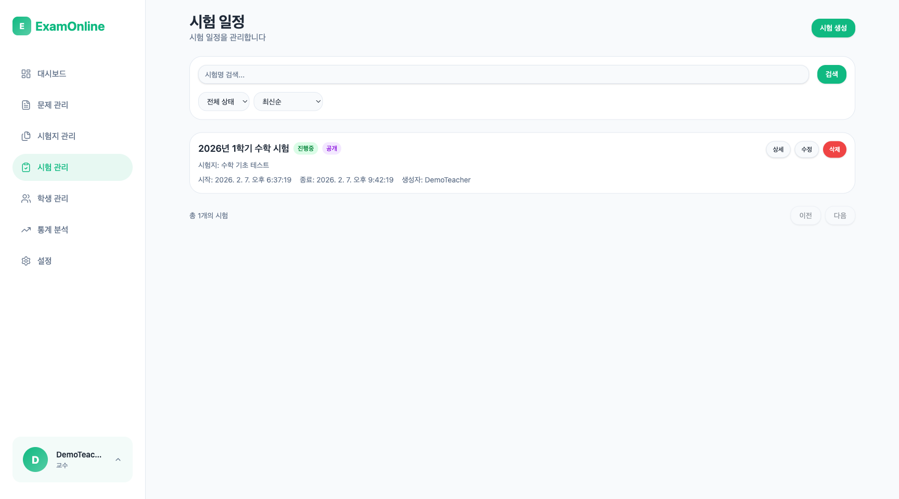
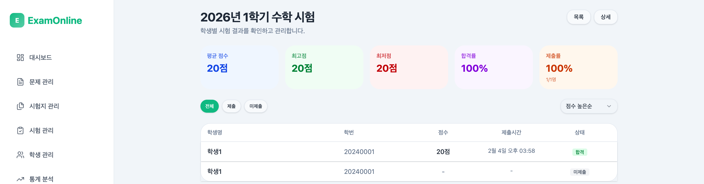
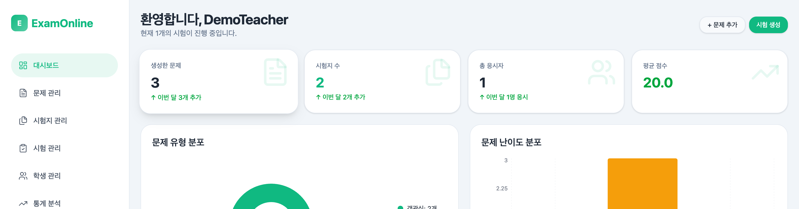

# Step 8: 교사 결과 확인

## 목표

교사 계정으로 로그인하여 학생들의 시험 결과를 확인한다.

---

## 진행 순서

### 1. 로그아웃

우측 상단의 프로필 메뉴에서 **로그아웃**을 클릭한다.

### 2. 교사 계정으로 로그인

**URL:** `/login`

| 필드 | 값 |
|------|-----|
| Username | demo_teacher |
| Password | demo1234! |

### 3. 시험 관리 페이지 접속

**URL:** `/examinations`

좌측 메뉴에서 "시험 관리"를 클릭한다.

### 4. 시험 결과 확인

"2026년 1학기 수학 시험"의 **결과 보기** 버튼을 클릭한다.

### 5. 학생별 결과 확인

응시한 학생 목록이 표시된다.

| 학생 | 점수 | 정답률 | 제출 시간 |
|------|------|--------|-----------|
| demo_student1 | 30/30 | 100% | (제출 시간) |

### 6. 상세 결과 확인

"demo_student1"의 결과를 클릭하여 상세 내용을 확인한다.

**문제별 채점 결과:**

| 문제 | 학생 답안 | 정답 | 결과 | 배점 | 획득 |
|------|-----------|------|------|------|------|
| 다항식 인수분해 | (x+3)(x+4) | (x+3)(x+4) | 정답 | 10점 | 10점 |
| 부분집합 개수 | 32 | 32 | 정답 | 10점 | 10점 |
| 등차수열 제10항 | 29 | 29 | 정답 | 10점 | 10점 |

---

## 예상 결과

- 학생 demo_student1의 최종 점수: 30/30 (만점)
- 모든 문제 자동 채점 완료
- 정답률: 100%

---

## 데모 완료

전체 데모 시나리오를 완료했다.

### 데모에서 확인한 기능

| 기능 | 설명 |
|------|------|
| 교사 로그인 | 교사 역할로 시스템 접근 |
| 문제 생성 | 객관식, 빈칸채우기 문제 생성 |
| 시험지 생성 | 여러 문제를 묶어 시험지 구성 |
| 시험 생성 | 시간 설정 및 공개 여부 설정 |
| 학생 로그인 | 학생 역할로 시스템 접근 |
| 시험 응시 | 문제 풀이 및 답안 제출 |
| 결과 확인 | 학생/교사 양측에서 결과 확인 |
| 자동 채점 | 객관식, 빈칸채우기 자동 채점 |

---

## Navigation

[이전: Step 7 - 학생 결과 확인](./07-result-check.md) | [목록으로 돌아가기](./README.md)
